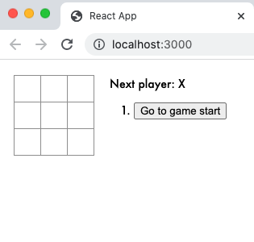
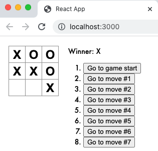
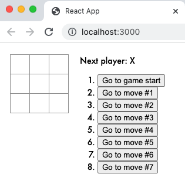

```⠀⠀⠀⠀⠀⠀⠀⠀⠀⠀⠀⠀⠀⠀⠀⠀⠀⠀⠀⠀⠀⠀⠀⠀⠀⠀⠀
⠀⠀⢠⣶⠾⠷⢦⡄⠀⢰⡆⠀⢠⣶⠾⠷⣶⡄⠀⣾⡆⠀⠠⣤⡀⣠⣤⠀⠀⠀
⠀⠀⢺⡇⠀⠀⢈⣿⠀⢸⡇⠀⣿⡁⠀⠀⢈⣿⠀⣿⡇⠀⠀⣨⣿⣿⡁⠀⠀⠀
⠀⠀⠈⠻⠶⠶⠟⠁⠀⢸⡇⠀⠘⠻⠶⠶⠟⠃⠀⣿⡇⠀⠘⠛⠁⠈⠛⠀⠀⠀
⠀⠀⢀⣀⣀⣀⣀⣀⣀⣸⣇⣀⣀⣀⣀⣀⣀⣀⣀⣿⣇⣀⣀⣀⣀⣀⣀⡀⠀⠀
⠀⠀⠙⠛⠛⠛⠛⠛⠛⢻⡟⠛⠛⠛⠛⠛⠛⠛⠛⣿⡟⠛⠛⠛⠛⠛⠛⠃⠀⠀
⠀⠀⠀⠀⠀⠀⠀⠀⠀⢸⡇⠀⠠⣦⡀⢀⣴⠄⠀⣿⡇⠀⣠⡶⠟⠷⣦⡀⠀⠀
⠀⠀⠀⠀⠀⠀⠀⠀⠀⢸⡇⠀⠀⢈⣿⣿⡁⠀⠀⣿⡇⠀⣿⠀⠀⠀⢸⡇⠀⠀
⠀⠀⠀⠀⠀⠀⠀⠀⠀⢸⡇⠀⠐⠟⠁⠈⠻⠂⠀⣿⡇⠀⠙⠷⣦⡶⠟⠁⠀⠀
⠀⠀⢀⣀⣀⣀⣀⣀⣀⣸⣇⣀⣀⣀⣀⣀⣀⣀⣀⣿⣇⣀⣀⣀⣀⣀⣀⡀⠀⠀
⠀⠀⠈⠉⠉⠉⠉⠉⠉⢹⡏⠉⠉⠉⠉⠉⠉⠉⠉⣿⡏⠉⠉⠉⠉⠉⠉⠁⠀⠀
⠀⠀⠀⣤⡀⢀⣤⠀⠀⢸⡇⠀⢠⣴⠶⠶⣦⡄⠀⣿⡇⠀⠀⠀⠀⠀⠀⠀⠀⠀
⠀⠀⠀⢈⣿⣿⡁⠀⠀⢸⡇⠀⣿⡁⠀⠀⢈⣿⠀⣿⡇⠀⠀⠀⠀⠀⠀⠀⠀⠀
⠀⠀⠀⠛⠁⠈⠛⠀⠀⠸⠇⠀⠘⠿⢶⡶⠿⠃⠀⢿⠇⠀⠀⠀⠀⠀⠀⠀⠀⠀⠀⠀⠀⠀⠀⠀⠀⠀⠀⠀⠀⠀⠀⠀⠀⠀⠀⠀⠀⠀⠀⠀⠀
```
# React Tic Tac Toe Game

## Introduction
Using a [tutorial](https://reactjs.org/tutorial/tutorial.html#lifting-state-up-again), I learnt how to make noughts and crosses, also known as tic tac toe, using React. The game allows two players to play on the same board using 'X' and 'O' characters. They can see the winner of the game and 'time travel' to any move that has already been made.

## Set up
1. Fork this repo
2. Clone to your local machine
3. Run `npm run build` to install all required node modules

## How to play
1. Run `npm start` in the project directory
2. Open [http://localhost:3000](http://localhost:3000) in a browser
3. Enjoy the game!

## Demo
### Start


### Winner


### Time travel


## Future integration
Will try to implement the below when not on a time constraint:
* Display the location for each move in the format (col, row) in the move history list.
* Bold the currently selected item in the move list.
* Rewrite Board to use two loops to make the squares instead of hardcoding them.
* Add a toggle button that lets you sort the moves in either ascending or descending order.
* When someone wins, highlight the three squares that caused the win.
* When no one wins, display a message about the result being a draw.
